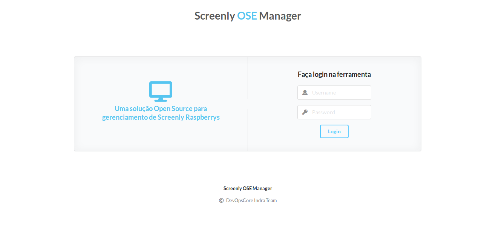
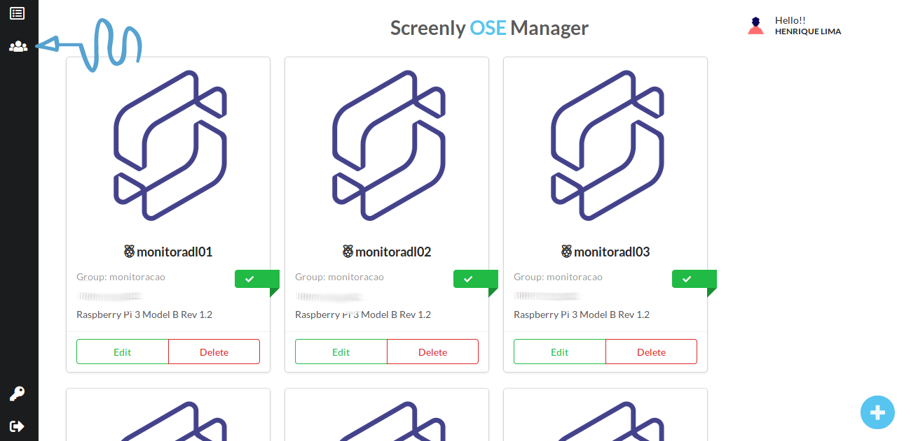
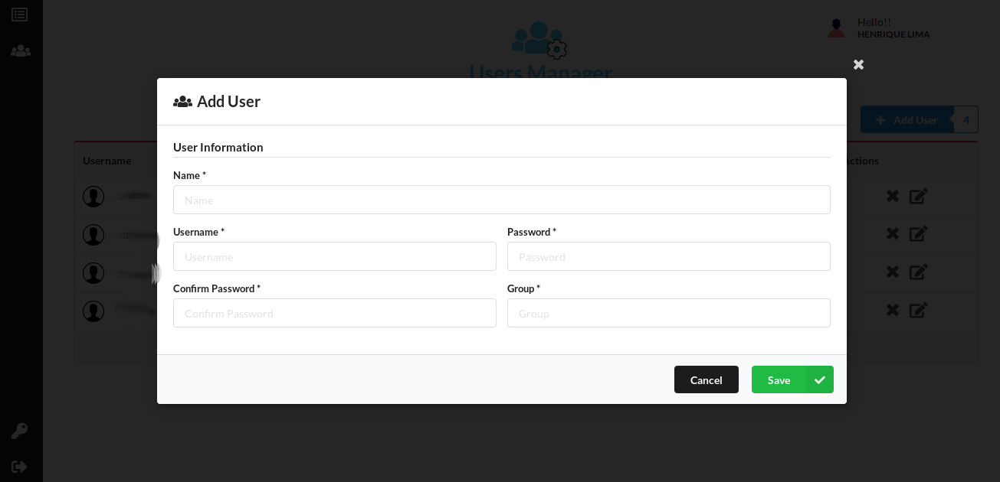

# Como utilizar Screenly OSE Manager

Esta aplicação lhe permite gerenciar os Assets(conteúdos) de multiplos devices através de uma única plataforma.  

Acesse a home page do Screenly OSE Manager:

## Gestão de Devices

### Adicionar Device

- Na página inicial clique no botão no canto direito inferior com o símbolo de "**+**";  

- Preencha os campos e clique em "**Save**".  

  

> Obs: Quando for adicionar um Device demora um pouco para aparecer os status "**online**", caso não atualize e continue "**offline**" os campos de credenciais estão errados.

### Editar Device
- Na pagina inicial, escolha qual Device deseja alterar.  

- Clique no botão "**Edit**" e preencha os campos que desejar;  

- Após preencher clique em "**Save**".  

### Excluir Device

- Escolha qual Device deseja excluir;
- Clique no botão "**Delete**", após clicar irá aparecer um modal;  

   

- Clique no botão "**Delete**" para confirmar.  

  

## Usuários do Sistema

### Adicionar usuário

- Clique no botão no canto esquerdo superior "**Manage Users**";  

 

- Após entrar na página clique no botão "**Add User**";  

  

- Preencha os campos e clique no botão "**Save**".

 
### Editar usuário
- Clique no botão no canto esquerdo superior "**Manage Users**";  

 

- Escolha o usuário e clique no botão "**Edit User**";

 

- Altere os campos desejados e clique em "**Save**".

### Excluir usuário

- Clique no botão no canto esquerdo superior "**Manage Users**";

- Escolha o usuário e clique no botão "**Delete User**";

- Após clicar abrirá um modal, clique no botão "**Delete**" para confirmar.

