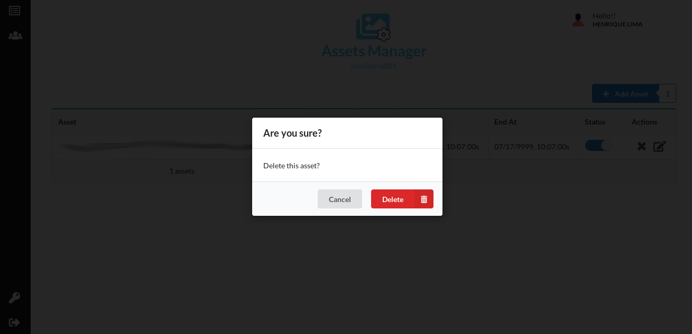

# Screenly OSE Manager

## Summary 

  - [Assets(Conteúdos) dos Devices](#assetsconteúdos-dos-devices)
    - [Inclusão de assets](#inclusão-de-assets)
    - [Editar assets](#editar-assets)
    - [Ativar/Desativar assets](#ativardesativar-assets)
    - [Excluir assets](#excluir-assets)
  - [Configuração do Usuário](#configuração-do-usuário)
    - [Alteração de senha](#alteração-de-senha)
  

## Como utilizar Screenly OSE Manager

Esta aplicação lhe permite criar e alterar Assets(conteúdos) dos Devices.  
Acesse a home page do Screenly OSE Manager:

**Link**: https://screenlymanager.cloudapps.indraweb.net/
 
 

## Assets(Conteúdos) dos Devices

### Inclusão de assets

- Escolha qual Device deseja adicionar os assets(conteúdos);  
- Passe o mouse em cima da foto do Device e clique no botão "**Manage Assets**";

 
 -  Após entrar na página clique no botão "**Add Asset**";

- Após abrir a modal escolha a aba "**URL**" ou "**File**" :

1. Caso seja "**URL**" preencha os campos e clique no "**Save**".

2. Caso for "**File**" faça upload da Foto ou Video e clique no "**Save**". 

### Editar assets

- Entre na página do Device escolhido.

 

- Localize a Asset(conteúdo) que deseja alterar e no final dela clique no botão "**Edit asset**";

- Após abrir a modal, preencha os campos que deseja alterar e clique em "**Save**".

### Ativar/Desativar assets
 
- Entre na página do Device escolhido;

 

- Localize a Asset(conteúdo) que deseja alterar os status, na coluna "**Status**" pode ativar e desativar a Asset.

### Excluir assets

- Entre na página do Device escolhido;

 

- Localize a Asset(conteúdo) que deseja excluir e no final dela clique no botão "**Delete asset**";

- Após clicar abrirá um modal, clique no botão "**Delete**" para confirmar.

## Configuração do Usuário

### Alteração de senha

- No canto esquerdo inferior clique no botão "**Change Password**"; 

- Preencha os campos e clique em "**Save**".

